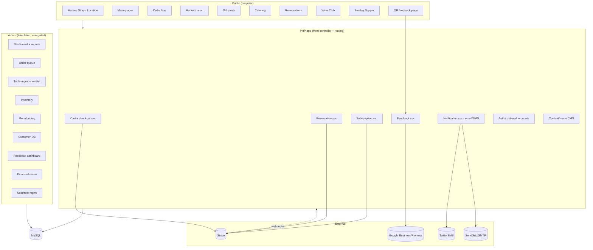

# Amelia's by EAT — Digital Platform Design Spec

**Date:** 2026-06-02
**Status:** Approved (brainstorm phase). **v7 (2026-06-04)** closes a gap-analysis review pass — gift-card-balance concurrency, refund→inventory restoration, catering balance-due collection, reservation/event cancellation & no-show money policy, the customer Account portal + favorites/addresses, a promotions model, ASAP-order throttling, day-part ordering rules, notification send-once idempotency, scheduled DB backups, a Terms/refund-policy page, blog + Amelia's Kiln scope, and assorted consistency fixes — see *Gap-closure corrections (v7)* below. **v6 (2026-06-04)** locks the public visual direction — verified earth-tone brand palette (navy dropped), real-photography art direction, the **v3 editorial design system** (`mockups/brand-v3.css` + `home-v3.html`), two new public pages (Purveyors, Careers), and extracted menu/site content for seeding — see *Public design system & content (v6)* below. **v5 (2026-06-03)** applies an internal-consistency review pass — see *Consistency corrections (v5)* below. **v4 (2026-06-03)** applies Aslan-skills conformance corrections from a full skill audit — see *Aslan-skills conformance corrections (v4)* below. The prior v3 review (RTM + decision classification, schema-design rigor, cutover runbook + 301s, alcohol DTC compliance) was applied as **inline methodology**. Note: several skills referenced in earlier drafts are **not installed** and have been relabeled as inline methodology (full list in the corrections section).
**Client:** Amelia's by EAT (ameliasaz.com), Scottsdale AZ
**Topic:** Full restaurant digital platform — website, e-commerce, reservations, payments, QR feedback, admin dashboard

---

## Summary

Replace Amelia's brochure site (ameliasaz.com) and its bolted-on third-party
tools (Square online ordering + gift cards, Yelp reservations) with a single,
unified, mobile-first platform built on the Aslan stack: **PHP 8+, MySQL,
GoDaddy/cPanel, GitHub Actions FTP deploy.** Payments run natively through
**Stripe** (Checkout/Elements → SAQ-A PCI scope). The platform comprises six
systems sharing one customer database, one menu/catalog, one order ledger, and
one admin dashboard:

1. Bespoke public marketing site + lightweight CMS
2. Native e-commerce (food ordering, retail "Market", gift cards, catering)
3. Native reservations (real-time availability, table mgmt, waitlist, events)
4. Stripe payments across all revenue streams (incl. Wine Club subscriptions)
5. Compliant QR feedback → Google Reviews + service-recovery alerts
6. Unified admin dashboard with role-based access (Owner / Manager / Staff)

The public storefront is **bespoke** (per `public-website-conventions`); the
operational surfaces are **templated** (per `internal-tool-*` conventions).

## Business meaning

**What this means for Amelia's operations:**

Today, Stacey's team runs the business across four disconnected tools: the
WordPress brochure, Square for online orders and gift cards, Yelp for
reservations, and manual processes for catering, the Market, Wine Club, and
Sunday Suppers. Every channel has its own login, its own customer list, and its
own fees. No one can answer "how much did we make across pickup + market + gift
cards + events this week?" without stitching together exports.

This platform collapses that into **one back office**. A host seats a table and
clears a waitlist from the same dashboard where a manager checks the lunch
pickup queue, adjusts a menu price, sees that the quinoa bowl is 86'd, and reads
last night's guest feedback. The owner sees one revenue number across every
stream and reconciles a single Stripe payout. Guests get one Amelia's-branded
experience — order pickup, book a table, buy a gift card, join the Wine Club,
grab a Sunday Supper seat — instead of being bounced to squareup.com and
yelp.com.

**Why it matters now:**

The fragmented stack caps revenue (no upsells/scheduling on Square's generic
flow), leaks margin to per-transaction third-party fees, and produces no
customer data the restaurant owns. The QR-feedback loop is the growth engine:
more Google Reviews lift local search rank, which drives the discovery the
brochure site can't. Stacey's brand is "conscious, source-to-plate" — a generic
Square page undercuts that; a bespoke site reinforces it.

## Goals

- One unified platform: one customer DB, one catalog, one order ledger, one admin.
- Mobile-first across every guest surface (most restaurant traffic is mobile).
- Own the customer relationship and the data; reduce third-party fees.
- Drive Google Reviews + local SEO compliantly.
- Give staff a fast, role-appropriate back office that matches in-restaurant workflow.
- PCI burden minimized (SAQ-A via Stripe-hosted card fields).

## Non-goals (this build)

- In-restaurant POS replacement or live POS inventory sync (documented seam only; human-blocked decision).
- In-house delivery fleet (own zones/drivers) — later client decision; schema-ready.
- Native mobile apps (responsive web first; brief lists apps as "future consideration").
- Multi-location (single Scottsdale location; model leaves room but doesn't build for N).

## Architecture

**Key components**

- **Front controller + router** (`public/index.php`, `.htaccess` pretty URLs) per `infra-project-scaffolding`.
- **PDO singleton + prepared statements** (`includes/Database.php`); `fmt_*` helpers per `backend-php-standards`.
- **Stripe integration** (`backend-stripe`): Checkout/Elements for one-time (orders, market, gift cards, catering, deposits) + Billing for Wine Club subscriptions; **webhook handler** (`backend-webhook-handler`) is the source of truth for payment state.
- **Notification service**: provider-agnostic interface; email (`client-transactional-email`) + SMS (Twilio) adapters; the customer chooses their channel(s) (`customers.notify_channel`); degrades gracefully to email if SMS (A2P 10DLC) approval lags.
- **CMS**: DB-backed menu/catalog + editable content blocks (no hardcoded menu) so staff update prices/items without a deploy.
- **CSS**: 5-file token architecture (`frontend-css-architecture`); bespoke public theme + templated admin theme.

## Data model (initial — full DDL in the plan)

**Schema-design rigor** (inline methodology — no external skill): historical rows **snapshot** the
mutable values they depend on (price, tax rate + treatment, name) so past orders
never re-total when prices change; **money is integer cents**, tax rates integer
**basis points**; every entity's `status` enum covers the **complete** lifecycle
(not the happy path); hidden many-to-many relations get **join tables**; FKs
declared (InnoDB); UTC timestamps; every non-obvious field traces to a requirement.

Core tables (MySQL, utf8mb4, UTC timestamps):

- `customers` (id, email, phone, name, optional `password_hash`, marketing_opt_in, **`notify_channel` [email|sms|both]** — the guest/customer chooses how they're contacted, created_at) — unified record; guest = no password.
- `categories`, `products` (type: food | retail | giftcard | catering; **`tax_category`** [prepared_food|retail_goods|grocery|service|non_taxable]; **`ships_dtc`** flag; per-state eligibility lives in the **`product_shippable_states`** join table, not an inline column/JSON — see C-DATA-3), `product_category_map` (**join table** — a product in many categories), `product_variants`, `modifier_groups`, `modifiers`, `product_modifier_map`, `dietary_tags`, `inventory` (stock, low_stock_threshold, is_86d).
- **`order_items` snapshot** `unit_price_cents`, `tax_amount_cents`, `tax_treatment`, name, and modifier deltas at purchase (never read live product price); `order_tax_lines` (**join table** — an order has many tax lines by category/jurisdiction); `tax_rates` (jurisdiction, tax_category, `rate_bps`, source, effective_on) **or** delegate to **Stripe Tax** (recommended since retail ships across jurisdictions).
- `orders` (id, customer_id, fulfillment_type [pickup|delivery_future], pickup_slot_id, **status [pending|paid|fulfilled|cancelled|refunded|partially_refunded|comped|voided|expired]** — complete lifecycle, not happy-path; `subtotal_cents`, `tax_cents`, `tip_cents`, `total_cents` (**integer cents**), stripe_payment_intent, created_at, **expires_at**), `order_items` (snapshotted — see above), `order_item_modifiers`. Orders are created **`pending` at checkout initiation** (not at webhook time) so the success page always has a record and the inventory hold has a home; the webhook flips `pending → paid`; an expiry sweep flips stale `pending → expired` and releases holds. **Stock/capacity restoration on reversal (C-V7-2):** a `cancelled`/`voided`/`expired` order, or a refund issued **before fulfillment**, returns the permanent decrement to reservable stock (and frees a pickup slot); a refund **after fulfillment** does NOT restore stock (the food/good is gone). `comped` and `voided` are **explicit admin actions** in the order queue (comp = zero-out with reason, no Stripe call; void = cancel an unfulfilled order), both audit-logged — not orphan enum values (C-V7-12).
- `pickup_slots` (date, time, capacity, **booked_count**) — kitchen pickup capacity limiting, and the **single source of truth for pickup-window capacity** (the `booking_*` tables below do NOT also model pickup — see v4 correction C-DATA-2). `booked_count` is mutated **only** via an atomic conditional claim (see *Concurrency, holds & inventory integrity*).
- `inventory_holds` (id, order_id, sku/product_id or pickup_slot_id, qty, expires_at) — short-lived claims placed at checkout start; converted to a permanent decrement on `paid`, released on `expired`/`cancelled`. The reservable-stock view = `inventory.stock − Σ active holds`.
- `gift_cards` (code, initial_balance, current_balance, purchaser_customer_id, stripe ref, status active|depleted|void), `gift_card_transactions` (the **append-only ledger**; `current_balance` is a cached column reconciled to `Σ transactions`). **Gift-card balance is a finite, concurrently-decremented resource and gets the same atomic-claim treatment as stock/slots (C-V7-1):** redemption is a guarded conditional `UPDATE gift_cards SET current_balance = current_balance - :amt WHERE code = :code AND current_balance >= :amt` with an affected-rows check (0 rows = insufficient/raced → reject), inside the checkout transaction, with the matching `gift_card_transactions` row written in the same transaction. A refund to a gift card is the inverse credit transaction. Never read-then-write the balance.
- **Bookings** (booking/availability model — inline methodology, no external skill): `booking_resources` (type table|event|appointment; capacity, min/max party, deposit_required, deposit_cents), `booking_slots` (resource_id, starts_at **UTC**, capacity, **`booked` counter claimed atomically**, status open|blackout|closed), `bookings` (slot_id, customer_id NULL for guest, party_size, **status held|confirmed|seated|completed|cancelled|no_show**, **`table_id` NULL until the host assigns a physical table at seat time**, deposit_payment_intent), `waitlist` (status waiting|offered|converted|expired). Slots pre-generated on a rolling horizon via an **idempotent, `flock`-guarded** cron (no duplicate slots on re-run; UTC/DST-safe; blackouts do not retro-cancel already-booked slots), respecting hours/blackouts/lead-time. Reservations and Sunday Supper events use this model; **pickup windows use `pickup_slots` (above), not this model** (v4 correction C-DATA-2).
- **`tables`** (id, label, section/area, min_party, max_party, status active|inactive, sort) — the physical floor. `booking_slots` capacity gates **availability** (atomic claim on `booked`); a host assigns a confirmed booking to a `tables` row at **seat time** (`bookings.table_id`). Reservations are **capacity-booked, table-assigned-on-seating** — not table-booked at reservation time; this powers screen 21's table timeline / seat-clear-turn / walk-ins while leaving the concurrency design (claim on slot capacity) intact (C-V5-1).
- **`catering_requests`** (id, customer_id NULL for guest, event_date, headcount, package/details, `quoted_total_cents`, `deposit_cents`, **status new|quoted|accepted|deposit_paid|balance_due|paid|declined|expired**, created_at) — a catering enquiry the admin prices; on acceptance it spawns a standard `pending` **deposit order** carrying the admin-entered, snapshotted custom line items + deposit. **Balance-due is explicit (C-V7-3):** the remaining `quoted_total − deposit` is collected via a **second `pending` balance order** the admin sends as a payable link before/at the event (Stripe PaymentIntent); the request reaches `paid` only when both the deposit and balance orders are `paid`. Both orders snapshot their line items; the two link back to the request. No separate negotiation entity (C-V5-5).
- **`product_shippable_states`** (product_id, state_code, allowed) — **join table** for regulated/wine DTC per-state eligibility, enabling shipping state-by-state; replaces any inline allowed-states column/JSON (C-DATA-3 / C-V5-6).
- `subscriptions` (Wine Club: customer_id, tier, stripe_subscription_id, status, current_period_end), `subscription_tiers`.
- **`promotions`** (code, type [percent|fixed|free_item], value, min_subtotal_cents, starts_at, ends_at, max_redemptions, per_customer_limit, applies_to [order|category|product], active) + **`order_discounts`** (order_id, promotion_id, **`discount_amount_cents` snapshotted** at apply time) — backs the cart's promo field (C-V7-6). A promo's redemption count is incremented under the same atomic-claim discipline as stock when it carries a `max_redemptions` cap; discount is computed pre-tax and the snapshotted line feeds reconciliation. (If the client does not want promo codes, the cart field and these tables are dropped together — no orphan UI.)
- **`customer_favorites`** (customer_id, product_id, created_at) and **`customer_addresses`** (customer_id, label, line1/line2, city, state, postal, is_default, purpose [billing|shipping]) — back the Account portal's reorder/favorites and saved addresses (screen 17, C-V7-5). Addresses are dormant until DTC wine shipping clears the compliance gate; billing address supports Stripe/AVS.
- **Notification send-once (C-V7-9):** reservation/event reminders and order-ready/confirmation sends are guarded by a `notification_log` (entity_type, entity_id, template, channel, sent_at) **unique on (entity, template, channel)** so a re-run of the reminder cron (or a retried webhook) never double-sends. The notifications queue (plan Task 1.4) carries the same idempotency key.
- `feedback` (id, rating, comment, table/QR source, created_at, resolved_by NULL), `feedback_alerts`.
- `users` (staff; role: owner|manager|staff, password_hash), `audit_log`.
- `content_blocks` (key, html, updated_by) for CMS-editable copy; `pages` (slug, title, body, seo_title, seo_desc, published); `media` (filename, path, alt, width, height, uploaded_by); `team_members` (name, role, bio, photo_media_id, sort, visible) — *optional content type*.
- `settings` (key, value, is_secret) — non-secret config (hours, tax rates, capacities, thresholds) in plaintext; **secrets AES-encrypted at rest** (app key in env), masked in UI, server-side only. Powers the self-service Settings/Integrations screen.
- `payments` / ledger view for reconciliation; `webhook_events` (idempotency).

## System 1 — Public marketing site + CMS

Bespoke, mobile-first, per `public-website-conventions` (industry-appropriate
2-font pairing; no AI-slop tells). Pages: Home, Our Story (Stacey/source-to-plate),
Menu (Day / PM / Happy Hour / Catering), Market, Location/Hours/Contact, plus
entry points to Order, Reserve, Gift Cards, Wine Club, Sunday Supper. High-quality
food imagery, JSON-LD (Restaurant + Menu), sitemap.xml, robots.txt, Google
Business optimization (`client-seo-sao`), social links (IG @ameliasbyeat),
analytics (`client-analytics`). Menu + key copy editable via CMS.
**Legal/footer pages (C-V7-11):** in addition to the privacy policy (C-T1-5), the
site ships a **Terms of Service + refund/cancellation policy** page (CMS-editable) —
required for taking payments, deposits, and gift cards, and the published policy
Stripe/banks reference in a chargeback dispute. A short refund/cancellation summary
is linked from checkout and the reservation deposit step. **Existing-content
carry-over (C-V7-10):** the live site's **blog** and the **Our Purveyors / Now
Hiring** content are accounted for — the blog is handled as a CMS `pages`-backed
**posts** type (simple list + post) so its indexed URLs survive cutover via 301s
rather than being silently dropped; the second location **"Amelia's Kiln" (Gilbert)**
and the parent brand **EAT by Stacey Weber** are out of build scope but get a
confirmed link-treatment decision (Open questions Q15) so their existing links/SEO
aren't orphaned.

> **Blocked on brand inputs** (see *Brand inputs gate*): the visual layer
> (palette, type, logo treatment) requires extracted/confirmed brand assets in
> `docs/BRAND-GUIDE.md` before it's finalized. IA, content, and the operational
> systems are not blocked.

**Acceptance (EARS)**
- The site shall render mobile-first (min-width media queries; admin list tables card-stack on phone, never horizontal-scroll) and pass Lighthouse **Perf ≥ 90 / A11y ≥ 95 / Best Practices ≥ 95 / SEO ≥ 95** on the top 5 public pages. The admin templated surface shall meet **Perf ≥ 85 / A11y ≥ 95** (SEO target waived).
- When staff edit a menu item price in admin, the public menu shall reflect it without a deploy.
- The site shall emit valid Restaurant + Menu JSON-LD on relevant pages.

## System 2 — E-commerce

Catalog with categories, variants, modifiers/add-ons, dietary tags, photos.
Cart + checkout for **food (pickup + scheduled slots)**, **retail Market**,
**gift cards**, **catering**. Per-slot kitchen capacity. Special instructions.
**ASAP throttling (C-V7-7):** an "ASAP" pickup order is **not uncapped** — it is
assigned to the **next open `pickup_slot`** (claimed atomically like any slot), so a
rush cannot flood the kitchen beyond per-slot capacity; the guest sees the resulting
quoted-ready time. A configurable minimum prep-lead (default 15 min) sets the
earliest ASAP slot. **Guest order cancellation (C-V7-13):** a guest may cancel a
placed pickup order **only while it is still `paid` and not yet `preparing`** (a
tokenized "cancel my order" link), which triggers a refund and stock restoration;
once the kitchen advances it, cancellation is staff-only.
Order confirmation + status notifications. Optional account → order history,
reorder, saved favorites. Gift cards: purchase (emailed code) + redeem at
checkout. Catering: lead-time rules + quote/deposit (modeled via
**`catering_requests`** — an accepted request spawns a standard `pending` order
for the deposit; see Data model). If a third-party delivery
channel exists today, add a link-out button (verify — open item).

**Order + inventory lifecycle (oversell-safe):** at checkout initiation the
system creates a `pending` order and places an **inventory/slot hold via an
atomic conditional claim** (see *Concurrency, holds & inventory integrity*). The
Stripe webhook confirms `pending → paid` and converts holds to permanent
decrements; payment failure or a hold-expiry sweep releases the hold and expires
the order. This closes the oversell window (two guests can no longer both claim
the last Market item or the last 12:30 slot) and the success-page gap (the order
row exists before the webhook lands).

**Acceptance (EARS)**
- While the reservable stock for a finite item (retail Market good, 86'd item) or a pickup slot is exhausted, the system shall refuse the claim and shall not let `booked_count`/stock go negative under concurrent checkouts.
- When a guest initiates checkout, the system shall create a `pending` order and an inventory/slot hold atomically, or reject if no capacity remains.
- When the Stripe webhook reports payment success, the system shall flip the order to `paid`, convert the hold to a permanent decrement, and send a confirmation **via the customer's chosen channel(s) — email and/or SMS**.
- When a `pending` order's hold expires without payment, the system shall release the hold and mark the order `expired`.
- When a gift card code is applied, the system shall claim the balance via a guarded atomic `UPDATE` (affected-rows check) inside the checkout transaction, write a `gift_card_transactions` row, and never let the balance go negative under concurrent redemptions (C-V7-1).
- When an order is cancelled/voided/expired, or refunded **before fulfillment**, the system shall restore the permanent stock decrement and free any pickup slot; a refund **after fulfillment** shall not restore stock (C-V7-2).
- When a promo code with a redemption cap is applied, the system shall increment its count atomically and reject once the cap is reached; the discount shall be snapshotted on `order_discounts` (C-V7-6).
- An "ASAP" order shall be bound to the next open pickup slot (atomic claim), respecting the minimum prep-lead, so ASAP cannot exceed per-slot kitchen capacity (C-V7-7).
- The order schema shall support adding a `delivery` fulfillment type without migration of existing orders.

## System 3 — Reservations

Real-time availability by party size + time slot against **`booking_slots`**
capacity (a host assigns a physical `tables` row at seat time — availability is
capacity-booked, table-assigned-on-seating; see Data model); instant
confirm; modify/cancel (tokenized links); waitlist; staff table-management
dashboard (seat/clear/turn). **Free for standard tables; Stripe deposit/hold
for large parties, private events, and Sunday Suppers.** Confirmation + reminder
(via the guest's chosen channel(s): email and/or SMS). Retires Yelp.

**Deposit cancellation & no-show money policy (C-V7-4 — Policy, client-confirmed):**
a deposit is **fully refundable until a configurable cutoff** (default 48h before
slot start) and **forfeit thereafter**; a `no_show` forfeits the deposit. The
cutoff window, refund/forfeit split, and whether a standard-table no-show is
penalized are **client Policy questions** (Open questions Q14) — the defaults above
are assumed-and-noted, reversible. **Restaurant-initiated cancellation** of a
booking or a whole Sunday Supper event **refunds every affected deposit/ticket in
full** via Stripe and notifies guests (C-V7-4). **Waitlist offer mechanics:** when
a table frees, the system offers it to the next waiter with a **configurable
time-to-claim window** (default 10 min); on expiry the offer rolls to the next
waiter (`offered → expired`), so a stale offer never holds capacity.

**Acceptance (EARS)**
- When a guest books an available slot, the system shall claim the slot atomically (no double-booking under concurrency) and confirm instantly, sending a confirmation **via the guest's chosen channel(s) — email and/or SMS**.
- While party size ≥ the large-party threshold (or for events/Sunday Suppers), the system shall require a Stripe deposit before confirming; the booking stays `held` until the deposit succeeds and is released on failure/expiry.
- When no slot is available, the system shall offer the waitlist; when a table frees, the system shall offer it to the next waiter with a configurable claim window and roll the offer onward on expiry (no held capacity).
- The reservation reminder shall send T-minus a configurable window before slot_start **via the guest's chosen channel(s) (email and/or SMS)**, and shall send **exactly once** per booking (guarded by `notification_log` — C-V7-9).
- While a deposit cancellation occurs before the configurable cutoff, the system shall refund the deposit in full; after the cutoff, or on `no_show`, it shall forfeit per policy (Q14).
- When the restaurant cancels a booking or a Sunday Supper event, the system shall refund every affected deposit/ticket in full and notify the guest(s).

## System 4 — Payments (Stripe)

Single Stripe account across streams. **Checkout/Elements** (hosted fields →
**SAQ-A**). One-time: orders, market, gift cards, catering, reservation deposits,
event tickets. **Billing/subscriptions**: Wine Club. **Webhooks are the source
of truth** (`payment_intent.succeeded`/`failed`, `checkout.session.completed`,
`invoice.paid`, `charge.refunded`, subscription lifecycle) with idempotency via
`webhook_events`. **Order rows are created `pending` (bookings `held`) at checkout
initiation** and flipped to `paid`/`confirmed` by the webhook (see System 2 lifecycle).
Refunds/adjustments from admin. Receipts auto-emailed. Apple Pay / Google Pay via
Stripe — **requires hosting Stripe's domain-association file**
(`/.well-known/apple-developer-merchantid-domain-association`) and registering the
production domain in the Stripe dashboard at launch, else the wallet buttons silently
don't render (C-V7; bound in the cutover/readiness tasks). PCI: no raw PAN touches
our server.

**Tax (Arizona TPT — not a flat sales tax):** Arizona levies **Transaction
Privilege Tax (TPT)**, Scottsdale layers its own municipal rate, and the two
in-platform classes are treated differently — **prepared food** vs **retail
Market goods**. **Gift cards are not taxed at purchase**, only when redeemed
against taxable goods. The data model therefore carries a per-category
tax-treatment (taxable / exempt / prepared-food-rate) rather than one global
rate, and gift-card *purchase* is exempt by design. **Stripe Tax** is the leading
candidate to compute combined state+city TPT correctly; final approach is an open
item with the client's bookkeeper.

**Acceptance (EARS)**
- The system shall never receive or store raw card numbers (SAQ-A).
- When a guest initiates checkout, the system shall create a `pending` order (or `held` booking) before redirecting to payment so the success page and the inventory hold both have a record.
- When Stripe sends a webhook, the system shall process it idempotently and treat it as authoritative for payment state (`pending → paid`, or release on failure).
- The system shall apply tax per product-category treatment (prepared food vs retail) and shall NOT tax gift-card purchases.
- When an admin issues a refund, the system shall call Stripe and reflect status + reconciliation.

## System 5 — QR feedback → Google Reviews (compliant)

Dynamic table-specific QR → mobile feedback page (rating + comment). **No review
gating:** the Google Review link is shown to **all** guests. Low scores
**additionally** create a `feedback_alert` (staff service-recovery notification)
and record in the dashboard with trend analytics + response-rate tracking.
Optional thank-you / follow-up. Built per `frontend-feedback-system`.

**Acceptance (EARS)**
- The feedback page shall present the Google Review link to every respondent regardless of rating (policy compliance).
- When a rating is at/below the low-score threshold, the system shall create a staff alert and flag it in the dashboard.
- The dashboard shall show response rate and rating trend over time.

## System 6 — Admin dashboard + roles

Unified BI: orders, reservations, feedback metrics, sales across all streams,
customer DB (history/preferences), menu/pricing bulk management, inventory +
low-stock alerts + 86'ing, financial reporting + Stripe reconciliation, staff
comms. **Roles:** Owner (all incl. financial recon + user mgmt), Manager
(ops + reports, no recon/user mgmt), Staff (orders, reservations, seating,
pickup-ready, feedback responses). 8 canonical page templates
(`internal-tool-page-templates`); Save in sticky-top; audit log.

**Acceptance (EARS)**
- While a user's role is Staff, the system shall hide financial reconciliation and user management.
- The dashboard shall show one combined revenue figure across orders, market, gift cards, catering, events, and subscriptions for a selected period.
- When inventory crosses the low-stock threshold, the system shall alert and allow 86'ing that propagates to the public menu.

## Cross-cutting

### Concurrency, holds & inventory integrity

Shared cPanel hosting gives us **no Redis and no app-level lock service** — so
oversell protection must live in MySQL (InnoDB). The surface is deliberately
narrow: made-to-order food is effectively infinite, so this only bites
**finite retail Market goods, 86'd items, pickup-slot throughput, booking-slot
capacity, gift-card balances, and capped promo-code redemptions** — but
those are exactly the cases that produce an angry guest at the counter or a
double-spent balance. **Every one of these uses the identical guarded
conditional `UPDATE` + affected-rows pattern** (C-V7-1 folds gift cards and
promos into the same mechanism — they are not a separate design).

Mechanism:

- **Atomic conditional claim** for slot capacity, e.g.
  `UPDATE pickup_slots SET booked_count = booked_count + :n WHERE id = :id AND booked_count + :n <= capacity;`
  then **check affected rows** — 0 rows = no capacity, reject. For finite SKUs,
  the equivalent guarded `UPDATE` against reservable stock, or a
  `SELECT ... FOR UPDATE` inside a transaction.
- **Hold at checkout start, not at payment.** The claim creates an
  `inventory_holds` row + `pending` order *before* redirecting to Stripe. The
  webhook converts the hold to a permanent decrement on `paid`; a lightweight
  cron/expiry sweep releases holds for `pending` orders that don't pay within
  the window (and flips them `expired`).
- **Reservable stock** = `inventory.stock − Σ active holds`; the storefront and
  admin both read this view so the last item disappears the moment it's held.

This is an explicit acceptance criterion (Systems 2 & 3) and a risk-register row.

### Brand inputs gate (public-facing visual design)

Per the updated `client-onboarding` + `workflow-brainstorm`, the **bespoke
public visual design (System 1) cannot be finalized without real brand inputs**:
logo (SVG), color palette, type pairing, and desktop+mobile screenshots of the
current site. `WebFetch` strips CSS/images, so these are gathered via
**Playwright** (render, screenshot, read computed styles, crawl linked CSS,
download the logo). If any can't be extracted, they are **marked human-blocked
and asked of the client — never invented.** Until brand inputs are in
`docs/BRAND-GUIDE.md`, System 1's *visual* layer stays blocked (information
architecture, content, and the non-visual systems can proceed). **v6 status:** the palette, fonts, and a real client photo set are now extracted/received (see the Brand decision-log entry + *Public design system & content (v6)*), and the v3 mockups build on them. The one remaining visual block is **Q13(a)** — confirming Audrey/Montserrat licensing vs. close free alternatives (Fraunces stands in until then).

### Configuration & secrets management (self-service)

The client must run the business **without a developer**. Every integration's
keys/IDs are entered and managed in the **Owner-only admin Settings screen** —
not in code or `.env` by an engineer. Pattern:

- **Encrypted at rest.** Secrets stored AES-encrypted with an app key held in the
  server environment (NOT in the DB). The DB never holds plaintext secrets.
- **Masked + reveal.** UI shows `••••••3xQ`; full value only on explicit reveal.
  Secrets are **never** emitted to public pages or client-side JS — server-side use only.
- **Test connection** per integration (Stripe, Twilio, email, Google, Maps) so the
  operator gets immediate feedback without exposing the secret.
- **Owner-gated + audited.** Only the Owner role sees/edits Settings; every change
  is written to `audit_log` (who/when).
- **Env fallback.** If a setting is unset in the DB, fall back to an env var for
  bootstrap/migration; DB value wins once set.
- **Self-service content (CMS):** images/media, homepage hero copy, announcement
  bar, Our Story, hours, footer, per-page SEO, and structured content types
  (e.g., team members — optional) are all editable in-admin. No deploy required.

Built per `security-hardening` (secret handling) + `internal-tool-page-templates`
(Settings page) + `client-image-optimization` (media).

- **Auth/accounts** (`security-hardening`, `security-demo-credentials`): guest checkout; optional customer accounts; staff auth with roles; CSRF, password_hash, secure sessions, rate limiting.
- **Notifications**: email + SMS (Twilio) behind one interface, **with the customer choosing their channel(s)** (`customers.notify_channel`); A2P 10DLC registration is human-blocked, so SMS delivery activates once it clears — **email is the fallback until then and for email-preferring customers**.
- **SEO/analytics**: `client-seo-sao`, `client-analytics`, Google Business.
- **Security/PCI**: SAQ-A; full headers/CSP (`security-hardening`); `.htaccess` hardening; uploads locked.
- **Performance**: `quality-performance`; image optimization (`client-image-optimization`); CDN-friendly assets.
- **Design system & accessibility baseline**: production CSS uses the `frontend-css-architecture` file set (`tokens`, `reset`, `base`, `components`, `utilities`, `theme` consumed via `main.css`) carrying shared primitives — `.visually-hidden`, `:focus-visible` rings (WCAG 2.4.13), semantic data-table chrome (scope, tabular figures, sticky/scroll Actions, column-priority hiding, **mobile card-stack via `data-label`, not horizontal scroll**), form primitives (label/required/hint/error/fieldset + error-summary), a destructive `.btn--danger`, an accessible toggle, and 44px touch targets (WCAG 2.5.5). **Two theme layers over the shared primitives preserve the functional seam (v4 correction C-CONV-1):** the public theme uses the bespoke 2-font pairing (**provisional placeholder: Fraunces display + body sans, pending brand-font confirmation in Q13** — the extracted brand fonts are Audrey/Montserrat; see *Brand inputs gate*); the **admin theme overrides `--font-display` to the body sans — the public display serif never appears inside the tool** (`internal-tool-typography`). The mockups' prototype CSS — admin `brand.css`, **public `brand-v3.css`** — is throwaway; production rebuilds both on the `frontend-css-architecture` file set (strips inline styles, min-width queries, tokens/components). The original 32 mockups were reviewed against `frontend-data-tables`, `frontend-form-patterns`, `frontend-interaction-patterns`, `frontend-filter-bars`, `frontend-feedback-system`, `internal-tool-*`, and `public-website-conventions` (gaps tracked in the v4 corrections); the public set was then **rebuilt on the v3 editorial system in v6** (see *Public design system & content (v6)*).
- **CI/quality**: `frontend-conventions-audit` on every PR; `quality-production-readiness` (63 items) before prod; `quality-playwright-e2e` smoke on critical flows.
- **Deploy**: `infra-ftp-deploy` (GitHub Actions); `infra-backup-rollback` before prod deploys; `data-mysql-setup` for DB.
- **Backups (C-V7-10):** the pre-deploy backup is **not** the only safety net — a **scheduled daily `mysqldump`** (flock-guarded cron, same dispatcher as the other crons) writes a dated, **off-server** copy (retained ~30 days) so a live restaurant's orders/payments survive corruption or a bad data write between deploys. Restore is dry-run-tested during cutover (a post-launch data issue is fixed forward, never by drop-and-reimport — see *Platform cutover*).

## Screen inventory & descriptions

Every screen in the platform, grouped by system. Each has a branded HTML mockup
in `docs/superpowers/specs/mockups/`. **Public-storefront mockups are rebuilt on the
approved v3 editorial design system** (`mockups/brand-v3.css`; `home-v3.html` is the
approved home, `home-v2.html` is the earlier critiqued draft kept for reference).
**Admin mockups** stay on the templated `mockups/brand.css` (the public/templated seam).
Descriptions below are the source of truth; mockups visualize them.

### Public storefront (bespoke)

1. **Home** (`home.html`) — Hero with logo + tagline ("When you eat well, you feel good") over food imagery; primary CTAs *Order Pickup* / *Reserve a Table*; hours + Scottsdale location strip; featured menu items; Market teaser; Wine Club + Sunday Supper promos; Our Story snippet; footer with IG, hours, address. States: open/closed indicator driven by hours.
2. **Our Story** (`story.html`) — Chef Stacey Weber narrative, source-to-plate values, purveyors, photography. Mostly editorial; CTA to reserve/order.
2b. **Our Purveyors** (`purveyors.html`) — *(public, v6 addition)* Named local farms/artisans (Noble Bread, Steadfast Farm, Crow's Dairy, Fra'Mani, Sweet Republic, …) with short blurbs + source-to-plate ethos. Linked from Our Story, the footer, and the menu's purveyor captions. Mirrors the live site's "Our Purveyors".
3. **Location & Contact** (`location.html`) — Address (8240 N Hayden Rd, Ste B-105), map embed, hours table, phone, contact form (Formspree), parking/directions.
4. **Menu — browse** (`menu.html`) — Tabbed day-parts (Day / PM / Happy Hour / Catering); category sections; each item = name, price, dietary badges (veg/GF), short description; "Add" button. **Primary is the on-page responsive menu** (all 104 items) with a secondary "view / print PDF" link to `docs/assets/*.pdf`; seed content lives in `docs/content/menus/{day,pm,happy-hour,catering}-menu.md`. Gluten-free + raw-food disclaimer in the footer; **per-item allergen flags** (in addition to veg/GF) where the client supplies them, with a standing "tell us about allergies" note (C-V7; allergen coverage is a Q12 data item). **Day-part ordering rule (C-V7-8):** the guest may **browse** any day-part at any time, but **ordering is restricted to the currently-active day-part** — an out-of-window item shows its price and a "available 4–10pm"-style note and its Add button is disabled until the window opens (each `products` row carries its day-part + an availability window; Happy Hour is the existing time-gated case generalized). States: item 86'd (greyed + "Sold out"), happy-hour/day-part time gating.
5. **Item detail / modifiers** (`item.html`) — Modal/page: large photo, description, dietary tags, modifier groups (radio/checkbox: size, add-ons, "no onion"), special-instructions field, quantity, live price, *Add to cart*. Validation on required modifiers.
6. **Cart + pickup scheduling** (`cart.html`) — Line items w/ modifiers, edit/remove, subtotal; **pickup time-slot picker** (ASAP→next-open-slot or scheduled; full slots disabled); **tip** (configurable preset %s + custom + none, applied post-tax on the order total; tip-distribution policy is operational, not in-app — Q16); **promo field** (validated against `promotions`, snapshotted to `order_discounts`, computed pre-tax) and gift-card field; reservable-stock guard messaging; *Checkout*.
7. **Checkout** (`checkout.html`) — Contact info (guest) or logged-in; Stripe Payment Element (Apple/Google Pay); order summary; tax (AZ TPT by category); pickup time; place-order. SAQ-A hosted fields.
8. **Order confirmation / status** (`order-confirmation.html`) — Confirmation #, pickup time, itemized receipt, live status (received → preparing → ready), "add to calendar", contact. Created from the `pending→paid` order.
9. **Market (retail)** (`market.html`) — Product grid (merch, pantry, specialty), filters/categories, stock indicators, add-to-cart; product detail. Shares cart with food.
10. **Gift cards** (`giftcards.html`) — Choose amount/design, recipient email + message + send date, purchaser info, buy. Tax-exempt at purchase. Redemption shown at checkout.
11. **Catering** (`catering.html`) — Packages, lead-time rules, headcount, date/time, customization, quote/deposit flow, contact. Quote tracked in `catering_requests`; acceptance creates a `pending` order for the deposit via Stripe.
12. **Reservations — booking** (`reserve.html`) — Party size + date + **real-time available slots**; guest details; **deposit step for large parties/events**; confirm; modify/cancel via tokenized link; **waitlist** when full.
13. **Wine Club — signup** (`wineclub.html`) — Tiers (monthly/quarterly) with perks + price; choose tier; Stripe subscription checkout. Compliance/age note.
14. **Wine Club — member portal** (`wineclub-portal.html`) — Membership status, next billing, payment method, pause/cancel, shipment/pickup history, perks. Stripe Billing-backed.
15. **Sunday Supper — events** (`supper.html`) — Upcoming ticketed suppers (date, theme, menu, price, seats left); seat selection; prepay via Stripe; ticket confirmation. Capacity-limited (atomic claim).
16. **QR feedback** (`feedback.html`) — Mobile-first: star rating + comment; **Google Review link shown to everyone** (compliant); on submit, low scores trigger staff alert; thank-you. Table-coded via QR param.
17. **Account** (`account.html`) — Order history + reorder, saved favorites, addresses, Wine Club status, reservations, profile. Optional (guest checkout still allowed). **Built by its own task (C-V7-5)** — backed by `customer_favorites` + `customer_addresses`; reorder rehydrates a past order's snapshotted lines into the cart (re-pricing against live products, flagging any 86'd/changed item). This is the customer-facing portal, distinct from the admin Customers DB (screen 24).
18. **Auth** (`auth.html`) — Login / create account / guest-continue; password reset. Customer-facing (separate from staff login).
18a. **Careers / Now Hiring** (`careers.html`) — *(public, v6 addition)* Join-the-team copy, values, open positions, and apply (mailto/form). Linked from the footer's "Now Hiring". Mirrors the live site's "Now Hiring".

### Admin (templated, role-gated — Owner / Manager / Staff)

18b. **Staff login** (`admin-login.html`) — Staff/role sign-in to the admin, **separate from the customer `auth.html` (screen 18)**. Demo creds gated by `aslan_is_demo()` (env AND hostname), copy-to-clipboard (no autofill), rate-limited; lockout via `login_attempts` (C-T1-6 / C-T1-7).
19. **Dashboard** (`admin-dashboard.html`) — KPI stats (today's revenue across all streams, orders, covers, avg feedback), revenue chart, live order queue snapshot, upcoming reservations, recent feedback, low-stock alerts. Role-filtered (Staff sees no financials).
20. **Order queue** (`admin-orders.html`) — Live incoming orders by status (new/preparing/ready/picked-up), pickup times, items+modifiers, mark-ready (fires notification), refund (full/partial, restores stock pre-fulfillment), **comp** (zero-out with reason, no Stripe call) and **void** (cancel an unfulfilled order) — both audit-logged (C-V7-12); filters; sound/badge on new.
21. **Reservations / table management** (`admin-reservations.html`) — Day view of tables + timeline, seat/clear/turn, waitlist, deposits status, walk-ins, party details; calendar.
22. **Menu & pricing** (`admin-menu.html`) — CRUD menu items, categories, prices (bulk edit), modifiers, dietary tags, photos, **86 toggle** (propagates to public menu), day-part assignment. Save in sticky-top bar.
23. **Inventory** (`admin-inventory.html`) — Stock levels for finite goods, low-stock thresholds + alerts, adjust counts, 86 status, reservable vs on-hand (nets holds).
24. **Customers** (`admin-customers.html`) — Customer DB: search, profile (order history, reservations, feedback, Wine Club, lifetime value, preferences), export. Unified by email/phone.
25. **Feedback dashboard** (`admin-feedback.html`) — Feedback list + filters, rating trend chart, response-rate metric, **service-recovery alerts queue** (low scores), mark-resolved, respond.
26. **Reports & reconciliation** (`admin-reports.html`) — Sales by stream/period, tax report, Stripe payout reconciliation, refunds, exportable. **Owner-only.**
27. **Users & roles** (`admin-users.html`) — Staff list, role assignment (Owner/Manager/Staff), invite, deactivate, audit log. **Owner-only.**

### Admin — configuration & content (self-service, no developer)

28. **Settings & Integrations** (`admin-settings.html`) — **Owner-only.** Self-service credentials for every integration (Stripe, Twilio, email/SendGrid+SMTP, Google Places/Reviews + GA4 + Tag Manager + Maps, social, reCAPTCHA): masked secret fields with reveal, per-integration **Test connection**, status badges, last-updated/by. Secrets **encrypted at rest, never exposed to the public site**, env fallback. Plus **business config**: hours, AZ TPT rates by category, pickup-slot capacity, large-party deposit threshold/amount, service fee, closures.
29. **Content (CMS)** (`admin-content.html`) — No-code editing of homepage hero, announcement bar (on/off + text), Our Story, hours note, footer; per-page **SEO** (title/meta); simple pages list; image insertion via Media.
30. **Media library** (`admin-media.html`) — Upload/manage images (JPG/PNG/WebP), alt text, where-used, copy URL, replace/delete, search.
31. **Team members** (`admin-team.html`) — *Optional / only if the SOW adds an "Our Team" section* (NOT on Amelia's current site). CMS for member photo + bio + role + display order + visibility. Included to demonstrate the CMS's structured-content capability for the kind of "add team members and descriptions" change the client may want.

> **Self-service principle:** the client operates the business without a developer — all API keys/IDs and routine content/photos are editable in-admin. Secrets are encrypted, masked, Owner-gated, and never shipped to the browser (see *Cross-cutting → Configuration & secrets management*).

## Suggested build sequencing (single spec, phased delivery)

Even as one spec, build/ship in dependency order to de-risk:

1. **Foundation:** scaffold, DB, auth/accounts, CMS, Stripe + webhooks, notification service, bespoke public site shell.
2. **Ordering + payments:** catalog, cart, pickup scheduling, gift cards, receipts → first revenue online.
3. **Reservations** (+ deposits, table mgmt, waitlist) → retire Yelp.
4. **Catering + Market + Wine Club subscriptions + Sunday Supper events.**
5. **QR feedback → Google Reviews + service-recovery.**
6. **Admin dashboard depth:** reporting, reconciliation, inventory alerts, roles hardening.
7. **Pre-launch:** SEO, performance, production-readiness, training/handoff.

(Exact task breakdown + EARS per task lives in the `workflow-plan` output.)

## Requirements traceability & decision classification

Per the inline spec-review + schema-design methodology (no external skills), the spec carries a lightweight
**Requirements Traceability Matrix (RTM)** and a **decision log**. The **rendered forward RTM** (requirement → screen → EARS) is the screen-coverage table in the implementation plan; the **backward RTM** (table/field → requirement) is in `db/SCHEMA.md` (plan Task 1.1):

- **RTM (both directions):** every SOW item + screen + EARS criterion maps to a
  spec element (forward = nothing missing); every table/field/feature maps to a
  requirement (backward = nothing orphaned). Maintained as the plan is written;
  the data-model lenses of the inline schema-design methodology (replay every screen, trace every
  lifecycle, snapshot check, cardinality check, write the owner's reports as SQL)
  drive the model half.
- **Decision classification** — each non-obvious decision tagged by owner:
  **Engineering** (correctness — snapshot, enum, join table, FK, idempotency →
  decided here), **Industry** (domain — no-shows, comps, 86'ing, tips,
  time-gating → decided here + `utility-deep-research`), or **Client** (they'd
  diverge → log it). Client decisions split: cheap/reversible → assume + note;
  **costly/irreversible (money, law, live data, schema) → ask first.**
- **Headline deliverable:** the short, high-value **client-question list** in the
  *Open client questions* section below — costly/irreversible items only, each
  tagged **Fact** (blocks building) or **Policy** (blocks acceptance).

> **Single source of truth:** this spec is it. The decision log, open client
> questions, and RTM all live in this document — not in separate files.

## Decision log

Confirmed decisions (the justification artifact). Newest first; don't re-litigate without a note here.

**Foundational** — Stack: Aslan default (PHP 8+ / MySQL / cPanel / GitHub Actions FTP). Project type: `internal-tool` (full gate; public pages bespoke). Approach: full-platform spec. Existing site ameliasaz.com (Square ordering/gift cards, Yelp reservations) is absorbed.

**Commerce engine** — Native ordering + payments in PHP/MySQL with **Stripe** (Checkout/Elements → SAQ-A); retire Square online ordering. POS: online-only inventory now, documented seam for later sync (client to confirm). Fulfillment: **pickup + scheduled slots** at launch; third-party delivery link-out if they have it; in-house delivery is a later client decision; order schema supports adding `delivery` without rework.

**Guest interaction** — Reservations native (real-time availability, table mgmt, waitlist; retires Yelp); free for standard tables, **Stripe deposit for large parties + events + Sunday Supper**. Notifications: **email + SMS** (Twilio) behind one interface, **customer chooses channel(s)**; SMS activates on A2P 10DLC approval, email is the always-available fallback. Accounts: **guest checkout + optional account**, one unified customer record.

**Feedback / admin / revenue** — QR feedback **compliant** (Google link to everyone; low scores → staff alert + dashboard). Admin roles: Owner / Manager / Staff. Wine Club: recurring **Stripe subscriptions** + member portal. Sunday Supper: ticketed events via booking + deposit.

**Navigation IA (v3, 2026-06-04)** — primary `Menu · Market · Wine Club · Sunday Supper · Catering · Our Story`; CTAs `Reserve` + `Order`. Footer carries `Now Hiring · Our Values · Our Purveyors · Gift Cards` + visit/hours/contact; **Location folds into the footer + the home "Come Visit" section** (not a primary nav item). Matches the live site's IA; bar capped so it never wraps. (Supersedes the v1 bar, which carried Location in the primary nav.)

**Self-service** — every integration credential + business config Owner-editable in admin (encrypted/masked/test-connection); CMS for hero/announcement/Our Story/hours/footer/media/SEO; team members optional (not in current site).

**Brand (verified via live-site extraction, v6 2026-06-04)** — current site is **WordPress + WooCommerce**. Verified palette is **warm desert earth-tone**: ink `#313530`/`#292B2C`, creams `#f9f6e4`/`#fafae1`, stone/taupe `#ccc6b9`, sage-grey `#9a9a8d`, **olive-green `#5f8219`** + **wheat-gold `#e1c188`** accents. **The previously-logged navy `#171A2D` is dropped from the public brand palette** (it survives only as the *admin* tool's primary — an internal-tool choice, not a public-brand color). Fonts actually served: display **Audrey**, body **Montserrat** ("San-Diego" / "Old Standard TT" / "Source Sans Pro" were absent from the served markup — treat as legacy; confirm licensing in Q13). Photography has a genuinely distinctive, ownable look in two modes — **high-key sun-drenched daytime** (cream-linen grounds, hard natural-light shadows, pastel glassware + edible-flower pops) and **B&W heritage** (1940s portrait of grandmother Amelia; grainy wine-night). Real client photos staged in `images/`; logo + sublogo in `docs/assets/brand/`. See *Public design system & content (v6)*.

**Spec v2/v3 reviews** — oversell-safe holds + pending-order lifecycle + conditional SMS + Square gift-card cutover + AZ TPT (v2); then the **inline spec-review pass**: RTM, schema-design rigor, booking model, cutover runbook + 301s, wine DTC compliance, marketing consent, unhappy paths (v3).

**Process note** — v1 nav and the first mockups were improvised without the frontend child-skills; corrected after pushback and now built against the skills with rationale captured here.

## Aslan-skills conformance corrections (v4)

A full audit (2026-06-03) checked this spec aspect-by-aspect against all installed Aslan skills. Two systemic outcomes and the per-area corrections below are now part of the source of truth; the implementation plan (`docs/superpowers/plans/2026-06-03-amelias-platform-plan.md`) carries each into the relevant task.

**Systemic — phantom citations relabeled.** Nine skills cited in earlier drafts are not installed: `workflow-spec-review`, `data-schema-design`, `data-booking-availability`, `backend-commerce-concurrency`, `backend-notifications`, `backend-settings-admin`, `backend-content-management`, `client-sales-tax`, `client-platform-cutover`. Every audit judged the *inline* content sound and self-supporting, so all references are **relabeled "inline methodology (no external skill)"**; the inline text remains the source of truth. No design change results from the relabel.

**Systemic — skill conflicts resolved (deliberate, documented deviations):**
- **Money type:** integer **cents** (and tax in **basis points**) overrides `data-mysql-setup`'s `DECIMAL(10,2)`. Use `BIGINT` cents for sums that can exceed INT range (gift-card totals, lifetime value).
- **Grants:** follow `data-mysql-setup` **least-privilege** (SELECT/INSERT/UPDATE/DELETE); explicitly reject `data-cpanel-management`'s `ALL PRIVILEGES` step.
- **Secrets:** DB-stored **AES-256-GCM**-encrypted (per-value IV), app key **env-only, never in DB**, masked/reveal, Owner-gated, audited, test-connection, env-fallback — a deliberate, stronger deviation from the mothers' `.env`-only default.

**Tier-1 corrections (correctness / legal):**
- **C-T1-1 Timezone:** store UTC; **display `America/Phoenix`** (Arizona, no DST). Override the formatter default (`America/New_York`) or every slot/reservation/reminder/billing time is hours off. Pin `time_zone='+00:00'` per DB connection; pin `utf8mb4_unicode_ci` collation.
- **C-T1-2 Cron integrity:** every cron job (slot-gen, **hold-expiry sweep**, reminders) uses the canonical `flock(LOCK_EX|LOCK_NB)` entry-point + `logs/cron.log` + failure alert; one staggered dispatcher, **no `* * * * *`** (shared-cPanel ban). Hold-expiry sweep runs every 5–15 min, aligned to Stripe checkout-session expiry. Without locking, concurrent sweeps double-release holds and break the oversell guarantee.
- **C-T1-3 Upload security (media library):** `finfo` MIME validation, random-hex filenames, `uploads/.htaccess` `php_flag engine off` + deny `.php/.phtml/.phar`, storage outside web root. (RCE vector otherwise.)
- **C-T1-4 CMS stored-HTML XSS:** `content_blocks.html` / `pages.body` are Owner-only-editable and **server-side sanitized against an allowlist** before render; all reflected params (e.g. QR `?table=`) and user content (feedback comments, special instructions) escaped via `e()`.
- **C-T1-5 Cookie consent + privacy policy:** a consent banner gates GA4/GTM (legally required for e-commerce per `client-analytics`); a public **privacy policy** page ships at launch. Tracking scripts never load on `/admin/`.
- **C-T1-6 Demo credentials + staff login:** add a **staff-login screen** (screen 18b — the customer `auth.html` is separate). Demo creds = `admin/password` + `user/password123`, **gated by `aslan_is_demo()` (env AND hostname)**, copy-to-clipboard (no autofill), bcrypt hashes-only in `seed.sql` (plaintext only in README). Staging gets Basic Auth + `noindex` + demo-login rate-limit.
- **C-T1-7 Auth hardening tables:** add `login_attempts` and `rate_limits` tables (absent from the original table list). Lockout 5/15-min on IP+username; rate-limit checkout, password-reset, and the unauthenticated **QR-feedback POST**. Session-ID regenerate on login + hijack (IP/UA) detection.
- **C-T1-8 CSP/SRI + headers:** hand-authored CSP allowlisting Stripe (`script-src`/`frame-src js.stripe.com`), GTM/GA4, Maps, Formspree, reCAPTCHA, fonts; `Permissions-Policy: payment=(self)`; pin+SRI CDN scripts (documenting Stripe.js/GTM SRI exceptions); `X-Content-Type-Options`, `X-Frame-Options`, `Referrer-Policy`, HTTPS-force, HSTS post-verify, `Options -Indexes`, explicit `.htaccess` deny-set for `config/`/`includes/`/`db/`/`logs/`/`*.sql`/dotfiles. **The Stripe webhook route must be a real path excluded from www/HTTPS 301 canonicalization** (a 301 on POST drops the body) and **CSRF-exempt but Stripe-signature-verified** (the two must not be conflated).

**Tier-2/3 corrections (conventions / completeness):**
- **C-CONV-1 Typography seam + UI infra:** admin theme overrides `--font-display` to the body sans; Fraunces (the **provisional** public display face pending Q13) serif is public-only (see *Design system* bullet); two theme layers over shared primitives. Production also adds what the mockups lack: real `<button>` hamburgers with `aria-expanded`/`aria-controls` + ESC + focus-return (not CSS-checkbox `<label>`s); admin toast containers + PRG `Flash` helper + native `<dialog>` confirms for destructive actions (`frontend-feedback-system`); `.filter-bar` with "All X" options + chips + mobile bottom-sheet on every admin list (`frontend-filter-bars`); error-summary on forms. **Reports (screen 26)** has no canonical template — document it as a Dashboard+List hybrid in `.frontend-conventions.json`. The public **Home hero** requires a min `rgba(0,0,0,0.5)` scrim over food imagery (text-over-photo contrast).
- **C-DATA-2 Pickup-slot dedup:** pickup capacity lives only in `pickup_slots`; `booking_resources` drops the `pickup_window` type (see Data model).
- **C-DATA-3 Underspecified tables:** define `audit_log` columns (actor, action, entity, before/after, at), the `payments`/ledger as a webhook-fed table vs a view (commit to one), `product_shippable_states` as a **join table** for wine allowed-states (not JSON), and **lifetime value** as a computed SQL aggregate over paid orders.
- **C-STRIPE-4 Billing is net-new:** `backend-stripe` covers only PaymentIntent/refund — Wine Club subscriptions + member portal + `invoice.paid`/subscription-lifecycle are built from scratch. Add `charge.dispute.created` handling + a `disputed` order status, and an inbound retryable-vs-permanent (500/200) webhook response policy.
- **C-TAX-5 Commit one tax path:** choose **Stripe Tax** *or* maintained `tax_rates`; if Stripe Tax wins, `order_tax_lines` snapshots Stripe-returned amounts and `tax_rates` is dropped (client/bookkeeper decision Q#8).
- **C-MIG-6 WooCommerce import:** customers can't carry WP password hashes — add `must_reset_password` + a forced-reset flow; download media before WP teardown.
- **C-RTM-7 Render the RTM:** the forward (requirement→screen→EARS) and backward (table/field→requirement) matrices are rendered as tables in the plan, not merely promised. The screen-coverage table in the plan is the forward half.
- **C-QUAL-8 Quality artifacts:** maintain `.frontend-conventions.json` (waivers via `AslanException FE-EX-{id}`); wire `audit.yml` + pa11y-ci + Lighthouse CI against the **production app dir** (exclude `docs/.../mockups/`); add `quality-performance` CWV/query-budget targets; Stripe **test-card matrix** (decline/3DS/insufficient-funds) + double-click-pay / back-button-recharge / expired-session as explicit E2E/QA acceptance; SendGrid domain/DKIM verification + a plain-text MIME part + CAN-SPAM physical-address footer (`client-email-templates`); custom 404/500 + `display_errors=Off` in prod.
- **C-HAND-9 Handoff deliverables:** `USER-MANUAL.md`, a training session, quick-reference card, and handoff email are explicit Phase-7 deliverables (`client-handoff`).
- **C-MISC-10:** reconcile the logo path to a single location (`docs/assets/brand/`); Restaurant + Menu JSON-LD authored from schema.org (not in `client-seo-sao`); add `llms.txt` + canonical + OG/Twitter tags; pin the production host (GoDaddy `aslanadv` vs staging) and confirm DocumentRoot can target `public/` (else keep `includes/config/uploads` above web root or hard-deny).

## Consistency corrections (v5)

An internal-consistency review (2026-06-03) reconciled the body against its own
v3/v4 corrections and resolved two open design forks. These are now part of the
source of truth; the implementation plan carries each into the relevant task.

- **C-V5-1 Reservations floor model:** added the **`tables`** entity (physical floor) + `bookings.table_id`. Availability is gated by `booking_slots` capacity (atomic claim on `booked`); a host assigns a physical table at **seat time**. Reservations are *capacity-booked, table-assigned-on-seating* — this powers screen 21's seat/clear/turn/walk-ins without disturbing the concurrency design. (Resolves the previously-undefined `tables` reference in System 3.)
- **C-V5-2 Screen inventory:** staff login (`admin-login.html`) added as **screen 18b**; mockup count corrected to **32** *(superseded: v6 added Purveyors + Careers → **34**; see C-V7-14)*; the dead `mockups/index.html` reference removed.
- **C-V5-3 Phantom citations finished:** residual body + risk-register citations of non-installed skills (`workflow-spec-review`, `data-schema-design`, `backend-notifications`) relabeled to inline methodology, completing the v4 relabel.
- **C-V5-4 Typography provisional:** Fraunces marked the **provisional** public display face pending brand-font confirmation (Q13); the extracted brand fonts are Audrey/Montserrat. Visual layer stays blocked per the *Brand inputs gate*.
- **C-V5-5 Catering quotes:** added **`catering_requests`** (status new|quoted|accepted|declined|expired); an accepted request spawns a standard `pending` order with admin-entered, snapshotted line items + deposit. No separate negotiation entity.
- **C-V5-6 Shippable-states join table:** `product_shippable_states` is now defined in the Data model (not only in C-DATA-3), replacing any inline allowed-states column/JSON.
- **Notifications — customer choice:** the guest chooses email and/or SMS (`customers.notify_channel`); the system sends via their chosen channel(s). SMS delivery activates once Twilio A2P 10DLC clears; email is the fallback until then and for email-preferring customers.
- **Naming normalized:** roles are **Owner / Manager / Staff** throughout (dropped "Owner/Admin" and "Staff/Host"); booking deposit state is `held` (orders use `pending`) — the two are no longer conflated.

## Public design system & content (v6, 2026-06-04)

The public storefront's visual direction is now locked and built. This pass extracted
the real brand from the live site, art-directed the client's own photography,
established an editorial design system, rebuilt every public page on it, and captured
the site's real content + menus for seeding.

### Verified brand (supersedes earlier guesses)
- **Palette (exact, from the live CSS):** ink `#313530`/`#292b2c`; creams `#f9f6e4`/`#fafae1`; taupe `#ccc6b9`; sage `#9a9a8d`; **olive `#5f8219`** + **wheat-gold `#e1c188`** accents. **Navy `#171a2d` is dropped** from the public palette (admin-only). For AA legibility on cream, links/details use a darkened olive (`#46600f`) and gold-ink (`#9c7833`); primary buttons use the brand **ink**.
- **Type:** display **Audrey** + body **Montserrat** (their real fonts). In mockups, **Fraunces** stands in for Audrey (provisional, pending Q13 licensing).
- **Photography — two ownable modes, art-directed on-page:** (1) **high-key sun-drenched daytime** — cream-linen grounds, hard natural-light shadows, pastel glassware + edible-flower pops; keep these bright (do NOT crush with a dark/matte LUT). (2) **B&W heritage** — the 1940s portrait of grandmother Amelia + Stacey in the kitchen, and grainy wine-night moments. Real interior (slatted wood, woven leather, globe sconces, cacti, the white wine wall) is the establishing material. Client photos staged in `images/`.
- **Anti-"AI look" principles (enforced):** real place-derived palette (not framework defaults); real photography (no stock); editorial layout — asymmetry, oversized display type, full-bleed ↔ contained rhythm, a paper-grain substrate, named-purveyor captions. **Banned:** numbered section labels (01/02), tiny uppercase eyebrow-over-heading, scrolling marquees, the italic-single-word gimmick, navy/indigo/purple.

### The v3 design system + pages
- **`mockups/brand-v3.css`** — the shared public design system (tokens, nav, buttons, page-hero, sections, menu-list, forms, cards, footer, a11y). Production folds this into the `frontend-css-architecture` file set.
- **`home-v3.html`** — the **approved** home (real copy: "The neighborhood just got better" + the conscious/source-to-plate lines; "When you eat well, you feel good" as a quiet philosophy band). **`home-v2.html`** — the earlier **critiqued** draft, retained for reference.
- **All 19 public pages rebuilt on v3** (story, location, menu, market, catering, wineclub, wineclub-portal, supper, giftcards, reserve, cart, checkout, order-confirmation, item, account, auth, feedback) **+ 2 new pages** closing content gaps: **purveyors**, **careers**. Mobile hero = full-bleed image + scrim + overlaid headline/CTA (best practice).

### Content captured for seeding
- **Menus → `docs/content/menus/`** (`day-menu.md`, `pm-menu.md`, `happy-hour-menu.md`, `catering-menu.md`) — full items, prices, modifiers, and platter sizes (12|24), structured for the `products`/`categories`/`modifiers` load. Source PDFs in `docs/assets/`. The Menu screen renders these on-page (day-part tabs) with a secondary print/PDF link.
- **Real site content** captured for the relevant pages: Wine Club (**$40/mo**, 3rd-Wednesday tasting 5–7pm, two somm-selected bottles, waived corkage, 15% off, in-house somms April + Stacey); Catering (3 offerings — Party Platters 48-hr lead, Boutique Catering by EAT, Meal Delivery order-Thu/deliver-Mon); Market categories (wine; grab-and-go incl. frozen soups/bone broth; home & gifting + candles/succulents/gift wall); Our Story (verbatim); hours/address/phone/email. Other real pages noted for carry-over: **Our Purveyors, Now Hiring, blog, second location "Amelia's Kiln" (Gilbert)**, and the parent brand **EAT by Stacey Weber**.

### Open
- **Q13(a)** font licensing (Audrey/Montserrat vs free alternatives) is the last visual blocker; Fraunces stands in.
- The `.html` render of this spec and `docs/BRAND-GUIDE.md` should be regenerated/updated from this v6 brand record.

## Gap-closure corrections (v7, 2026-06-04)

A gap-analysis review pass (2026-06-04) checked the spec for under-specified money
flows, unmodeled UI promises, and operational durability. Each item below is now
part of the source of truth and binds to a task in the implementation plan
(`docs/superpowers/plans/2026-06-03-amelias-platform-plan.md` → *Gap-closure
corrections (v7)* table). Most are folded into existing body sections (Data model,
Concurrency, Systems 1–4, screen inventory, risk register); this section is the
index.

**Critical (money / correctness / legal):**
- **C-V7-1 Gift-card balance concurrency.** Gift-card balance is a finite,
  concurrently-decremented resource and gets the **same atomic guarded-`UPDATE` +
  affected-rows claim** as stock/slots, inside the checkout transaction, with an
  append-only `gift_card_transactions` ledger and a reconciled cached
  `current_balance`. Capped promo redemptions use the same mechanism. Folds into
  *Concurrency* + Data model; new System-2 EARS; risk row. Binds: plan Task 2.5, 1.1.
- **C-V7-2 Refund → inventory/capacity restoration.** Cancel/void/expire and a
  **pre-fulfillment** refund restore the permanent decrement and free the pickup
  slot; a **post-fulfillment** refund does not. New System-2 EARS; risk row. Binds:
  plan Task 2.3, 2.5.
- **C-V7-3 Catering balance-due.** The deposit is one `pending` order; the remaining
  balance is a **second payable `pending` order**; the `catering_request` reaches
  `paid` only when both clear. New `catering_requests` columns/states. Binds: plan
  Task 4.2.
- **C-V7-4 Reservation/event cancellation & no-show money policy.** Configurable
  refundable-cutoff (default 48h) + forfeit-after / no-show-forfeit; restaurant-cancel
  refunds all in full + notifies. New System-3 EARS; Q14. Binds: plan Task 3.2, 4.5.

**Important (scope / UX / ops):**
- **C-V7-5 Customer Account portal (screen 17).** Gets its **own build task** (not
  folded into auth) + `customer_favorites` / `customer_addresses`; reorder rehydrates
  snapshotted lines re-priced live. Binds: new plan Task 6.6, 1.1.
- **C-V7-6 Promotions model.** `promotions` + `order_discounts` back the cart promo
  field (snapshotted, pre-tax, atomic redemption cap), or the field is dropped with
  the tables — no orphan UI. Binds: plan Task 1.1, 2.2, 2.4.
- **C-V7-7 ASAP-order throttling.** ASAP binds to the next open `pickup_slot`
  (atomic claim) + min prep-lead; no uncapped path. New System-2 EARS. Binds: plan
  Task 2.2.
- **C-V7-8 Day-part ordering rule.** Browse any day-part anytime; **order only the
  active day-part** (per-product window; Happy-Hour gating generalized). Binds: plan
  Task 2.1.
- **C-V7-9 Notification send-once.** `notification_log` unique on
  (entity, template, channel) makes reminders/confirmations idempotent against cron
  overlap and webhook retries. Binds: plan Task 1.4, 3.2.
- **C-V7-10 Durability + content carry-over.** Scheduled **daily off-server DB
  backup** (flock cron, ~30-day retention) independent of deploys; the live site's
  **blog** is carried as a CMS posts type so its URLs 301 cleanly. Binds: plan Task
  0.3 (backup), 1.6 (blog), 7.1 (301s).
- **C-V7-11 Terms/refund-policy page.** A CMS-editable **Terms of Service +
  refund/cancellation policy** ships alongside the privacy policy, linked from
  checkout + the deposit step. Binds: plan Task 1.6, 7.1.

**Minor (polish):**
- **C-V7-12 `comped`/`voided` are real admin actions** (comp = zero-out w/ reason,
  no Stripe; void = cancel unfulfilled), audit-logged — not orphan enum values.
  Binds: plan Task 2.5.
- **C-V7-13 Guest order cancellation** via tokenized link while `paid` & not yet
  `preparing` (refund + stock restore); staff-only thereafter. Binds: plan Task 2.5.
- **C-V7-14 Apple/Google Pay domain verification** — host
  `/.well-known/apple-developer-merchantid-domain-association` + register the prod
  domain in Stripe at launch (else wallet buttons silently don't render). Mockup
  count is **34** (v6 added Purveyors + Careers). Binds: plan Task 2.4, 7.3.
- **Allergen flags** per item where supplied + a standing allergy note (beyond
  veg/GF); a Q12 data item. **Tipping** presets confirmed via Q16.

**Consistency fixes (carried into the plan):** Task H1 tracks client answers
**inline in this spec** (single source of truth), **not** in a separate
`docs/client-context/open-questions.md` (per Renato); the plan's RTM forward
coverage map gains rows for **2b Purveyors, 18a Careers, 18b Staff login**; residual
plan citations of non-installed skills (`data-schema-design`, `client-platform-cutover`)
are relabeled inline methodology.

## Questions we need Amelia's to answer

Plain-English questions for the client. We can keep building most of the platform
without these, but a few (marked 🔴 **Must answer before launch**) are blockers for
that specific piece. Each says *why it matters* and *what we'll do by default* if
we don't hear back.

### About wine & alcohol

1. **Do you want to ship wine to customers, or is wine pickup-only at the restaurant?** 🔴
   *Why it matters:* shipping alcohol is heavily regulated — it's only legal in
   certain states, needs special licenses and tax registration, and the delivery
   driver must check ID (21+) at the door. Some states ban it outright. Getting
   this wrong isn't just buggy, it's illegal.
   *Default if unanswered:* wine is **pickup-only** (ID checked in store); online
   wine shipping stays switched off until the legal side is confirmed.

2. **How do you want to confirm customers are 21+?** Our plan: check ID at pickup;
   if we ever add shipping, the carrier requires an adult signature. OK?

3. **Do you want to send marketing emails/texts (promos, newsletters) — not just
   order confirmations?** If yes, the law requires a clear opt-in, an unsubscribe
   link in every message, and a privacy policy. We'll set that up; just confirm.

### About switching off your current tools

4. **People may already hold Square gift cards. How should we handle them on
   launch day?** 🔴 Options: (a) import their balances so the cards just work in
   the new system, (b) keep Square running a while so old cards still redeem, or
   (c) turn Square off and personally notify holders. *This is real money owed —
   we can't ignore it.* Also: can you get a gift-card balance export from Square?

5. **What do you use at the front counter for in-person orders today (Square
   register, etc.)?** Should the website's stock counts stay in sync with it, or
   is it fine for now if online and in-person inventory are tracked separately?
   *Default:* separate, with the option to connect later.

6. **Your current website runs on WordPress/WooCommerce. Is there anything in it
   to carry over — products, customer list, past orders — or do we start fresh?**

7. **Is the Wine Club already billing members somewhere today?** If so, we'll move
   them carefully so nobody gets double-charged or accidentally cancelled.

### About money & tax

8. **We need your bookkeeper to confirm the tax rates** to charge on (a) prepared
   food vs (b) market/retail items in Scottsdale, and that gift cards aren't taxed
   until they're spent. We can also let the payment system (Stripe) calculate tax
   automatically for a small fee — do you prefer that, or a fixed rate we maintain?

### Things we need from you to build & launch

9. **Automated text messages** (order-ready, reservation reminders) require
   registering your business with the phone carriers first — that takes a few
   weeks, so we'd start now. (Email works immediately regardless.) Go ahead?

10. **Logins/accounts we'll need:** a Stripe account (payments), access to your
    Google Business listing, a Google Maps key, your website host login
    (GoDaddy/cPanel), and any FTP details. Who can get these to us?

### About the menu, programs & look

11. **Do you currently offer delivery (DoorDash/Uber Eats)?** If so we'll add a
    "Get it delivered" button linking to it. Running your *own* delivery (your
    drivers) is a bigger commitment we'd treat as a later decision — tell us if
    you want it.

12. **We need your full menus** (Day, PM, Happy Hour, Catering) with prices,
    options/add-ons, and dietary tags; plus **Wine Club** tier prices + what
    members get, and **Sunday Supper** price, seats, and how often.

13. **Brand:** (a) the fonts on your current site (**Audrey** display, Montserrat
    body) may be paid licenses — can you confirm we can use them, or should we pick
    close free alternatives? *(Until confirmed, the mockups use Fraunces as a
    stand-in.)* (b) **Photos — received:** you've given us a real photo set (now in
    `images/`) and we're using it. Anything higher-res or additional — a named
    grower/purveyor portrait especially — is welcome but not blocking.

### About policies (we've assumed sensible defaults — confirm or change)

14. **Reservation deposits & no-shows (Policy).** For large parties / events /
    Sunday Suppers that take a deposit: until when is it fully refundable, and is it
    forfeit after that? *Default we'll use unless you say otherwise:* fully
    refundable up to **48 hours** before, forfeit after, and a no-show forfeits the
    deposit. Standard (free) tables aren't penalized. If you cancel an event, we
    refund everyone in full automatically.

15. **Existing content we found on your site (Scope).** Your live site has a
    **blog**, an **Our Purveyors** and **Now Hiring** page, a second location
    **"Amelia's Kiln" (Gilbert)**, and the parent brand **EAT by Stacey Weber**.
    We're rebuilding Purveyors + Now Hiring and carrying the blog so its Google
    links don't break. **Kiln and EAT are out of this build** — do you want simple
    links out to them (so their existing links/SEO aren't orphaned), or left off
    entirely?

16. **Tipping (Policy).** We'll show tip presets at checkout on pickup orders
    (e.g. 10 / 15 / 20 % + custom + none). Confirm the presets you want, and note
    that how tips are distributed to staff is handled in your payroll, not the
    website.

## Platform cutover (Square / Yelp / WooCommerce → Aslan)

Per the inline platform-cutover methodology. This project **replaces systems real customers
already use**, so the switchover — not the build — is the dangerous part.

**Incumbent inventory (what customers hold):**
- **Square gift cards / balances** — real money owed; **cutover blocker** (Risk row).
- **Square open/online orders** in flight at cutover.
- **Yelp reservations** already booked.
- **WooCommerce store** (the current WP site is WooCommerce) — products, customers, possibly orders; export/migrate vs start clean (`data-shopify-migration`-style).
- **Any existing subscriptions** (if Wine Club already bills somewhere) — don't double-bill or lapse members.
- **SEO surface** — indexed URLs, the Google Business Profile + reviews.

**Per money-touching item, choose explicitly:** honor-by-import · parallel-run · hard-cut + comms. Gift cards → honor-by-import or parallel-run, never a silent hard-cut.

**SEO/entry points:** 301-redirect every indexed old URL to its new equivalent (map them; no blanket-to-home — `infra-htaccess`); preserve the Google Business Profile + reviews and update its site URL (`client-seo-sao`); update third-party links (Yelp/DoorDash/IG bio).

**Cutover runbook** (dated, in the plan): final timestamped export → import + reconcile money totals exactly → deploy with backup (`infra-backup-rollback`) + flip → enable 301s → smoke-test money paths (buy+redeem gift card, place+pay order, book reservation) → incumbent to agreed end-state → send customer comms → watch logs/payments 24–48h with rollback ready.

**Acceptance (EARS):** Every incumbent money balance shall have a documented honor/parallel/hard-cut decision before cutover. When a customer presents a pre-existing Square gift card after cutover, the system shall honor it per the chosen strategy. Every indexed incumbent URL shall 301 to its new equivalent. When cutover completes, affected customers shall have been notified.

## Regulated products — alcohol (wine) DTC compliance

**Wine Club ships wine, and the Market may sell wine — alcohol direct-to-consumer
(DTC) shipping is regulated per US state and can make a feature illegal, not just
wrong** (flagged in the inline spec-review pass). This is a **Blocker**, not an open item.

- **Per-state legality + licensing:** DTC wine shipping rules differ by state; some prohibit it, most require the seller to hold/observe DTC permits and remit that state's taxes. Arizona DTC + each ship-to state must be confirmed with the client + legal/compliance before enabling shipping.
- **Age verification at delivery:** carriers must use an adult-signature service (e.g. UPS/FedEx 21+ adult signature); alcohol cannot ship via USPS. Age gate at purchase is **not** sufficient on its own.
- **Default until cleared:** Wine Club + any wine in the Market launch **pickup / local only** (in-store, ID checked on pickup); **shipping is gated off** until per-state licensing, carrier adult-signature, and tax registration are confirmed. Model a per-product `ships_dtc` flag + allowed-states list so shipping can be enabled state-by-state.
- **Sunday Supper / Happy Hour alcohol service** is on-premise (normal liquor license) — out of this compliance scope; only **off-premise shipping** triggers DTC rules.

**Acceptance (EARS):** While DTC wine shipping is not legally confirmed for a ship-to state, the system shall not offer wine shipping to that state (pickup only). When wine is purchased, the system shall require age confirmation, and shipped wine shall require carrier adult-signature (21+).

## Unhappy paths & screen states

Per the inline spec-review methodology, each screen specifies its **empty / loading / error**
states and each money/booking flow its **failure paths**: payment declined or
failed, cart abandoned, **hold expired** (capacity released, order → `expired`),
**webhook never arrives** (reconciliation/retry; success page reads the `pending`
row), deposit abandoned (booking hold released), gift-card insufficient balance,
slot taken between view and submit (atomic claim rejects → re-prompt), and
notification-send failure (queue/retry; email independent of SMS).

## Risk register

| Risk | Likelihood | Impact | Mitigation |
|---|---|---|---|
| **Oversell under concurrent checkout** (last Market item / last pickup slot / 86'd item claimed twice) | Med | High | Atomic conditional `UPDATE ... WHERE booked_count+ n <= capacity` + affected-rows check (or `SELECT ... FOR UPDATE`); hold placed at checkout start, not at webhook; reservable-stock view nets active holds. Narrow surface (made-to-order food is infinite). Acceptance criterion in Systems 2 & 3. |
| **Paid-but-no-order gap** (order created only on lagging webhook) | Med | Med | Create `pending` order at checkout initiation; webhook confirms; success page reads the pending row; expiry sweep releases unpaid holds |
| **Existing Square gift-card balances** — a real guest redeems a card the new system never heard of (money-touching cutover blocker) | High | High | **Decide explicitly before cutover:** (a) import balances into `gift_cards`, (b) run Square gift cards in parallel during transition, or (c) hard-cut with guest comms. Not a quiet line item. |
| Twilio A2P 10DLC approval delays SMS | High | Med | Email-independent notification interface; the customer chooses email and/or SMS, and SMS delivery activates when the channel (A2P 10DLC) is approved; email is the fallback so notifications never fully depend on SMS |
| AZ TPT / Scottsdale tax computed wrong (prepared food vs retail vs gift-card exemption) | Med | High | Per-category tax treatment in the data model; gift-card purchase exempt; evaluate Stripe Tax; confirm with client bookkeeper before launch |
| cPanel/shared hosting limits (cron, concurrency, real-time) | Med | Med | InnoDB atomic claims (no Redis needed); availability computed on request; lightweight cron for reminders + hold expiry; cache hot pages |
| Square cutover (orders/gift cards in flight) | Med | High | Migration plan; run parallel briefly; gift-card balances handled per the row above |
| **Alcohol (wine) DTC shipping illegal/unlicensed per state** | High | High | **Blocker.** Launch wine pickup-only; shipping gated off until per-state licensing + carrier 21+ adult-signature + tax registration confirmed with client/legal. Per-product `ships_dtc` + `product_shippable_states`. (inline spec-review) |
| Cutover SEO loss (lost rankings/links) | Med | Med | Map + 301 every indexed URL (no blanket-to-home); preserve Google Business Profile + reviews; update third-party links (inline platform-cutover methodology, `client-seo-sao`) |
| Marketing consent / CAN-SPAM on `marketing_opt_in` | Low | Med | Explicit opt-in, unsubscribe in every marketing send, privacy policy; transactional vs marketing separated (inline notifications methodology) |
| Schema reconciliation breaks (historical rows read live values) | Med | High | Snapshot unit_price/tax_amount/tax_treatment/modifier deltas on order lines; integer cents; reconcile vs Stripe payouts (inline schema-design methodology, `backend-stripe`) |
| PCI missteps | Low | High | Stripe hosted fields only (SAQ-A); never touch PAN; webhook-authoritative |
| Menu/inventory drift vs in-restaurant POS | Med | Med | Online-only inventory now; documented sync seam; decision deferred |
| Scope (6 systems) overruns | High | Med | Strict workflow-plan phasing; ship revenue path (ordering) first |
| Brand assets missing block design | Med | Low | Derive provisional palette/pairing; swap when client provides |
| **Gift-card balance double-spend / negative balance** under concurrent redemption or a redeem-racing-refund | Med | High | Same atomic-claim discipline as oversell — guarded `UPDATE … WHERE current_balance >= :amt` + affected-rows check inside the checkout transaction; append-only `gift_card_transactions` ledger; `current_balance` reconciled to the ledger (C-V7-1) |
| **Refund/cancel leaks stock or capacity** (finite Market good cancelled but never returned) | Med | Med | Explicit reversal rule: cancel/void/expire and pre-fulfillment refund restore the decrement + free the slot; post-fulfillment refund does not (C-V7-2) |
| **Catering balance-due never collected** (only the deposit is modeled) | Med | Med | Explicit two-order flow — deposit order + a second payable balance order; request reaches `paid` only when both clear (C-V7-3) |
| **Deposit/no-show/event-cancel money disputes** (forfeit vs refund unclear; restaurant cancels an event) | Med | Med | Configurable refundable-cutoff + forfeit policy (Q14, defaults assumed-and-noted); restaurant-cancel refunds all in full + notifies (C-V7-4) |
| **ASAP orders flood the kitchen** beyond capacity during a rush | Med | Med | ASAP binds to the next open `pickup_slot` (atomic claim) + min prep-lead; no uncapped ASAP path (C-V7-7) |
| **Duplicate reminder/confirmation sends** (cron overlap, retried webhook) | Med | Low | `notification_log` unique on (entity, template, channel); send-once guarantee (C-V7-9) |
| **Data loss between deploys** (only pre-deploy backup exists) | Low | High | Scheduled daily off-server `mysqldump` (flock cron, ~30-day retention), restore dry-run-tested; forward-fix not drop-and-reimport (C-V7-10) |
| **Cutover drops the blog / orphans Kiln + EAT links** (lost indexed URLs) | Med | Med | Blog carried as a CMS posts type so URLs 301 cleanly; Kiln/EAT link-treatment decided with client (Q15), not silently dropped (C-V7-10/11) |
| **Account screen promises (reorder/favorites) unbuilt or unmodeled** | Low | Med | Dedicated Account task + `customer_favorites`/`customer_addresses`; reorder rehydrates snapshotted lines re-priced live (C-V7-5) |

## Open / human-blocked items

See **Open client questions (Fact / Policy)** above — that list is the single,
authoritative set of outstanding decisions/blockers (POS, delivery, Twilio, brand
licensing, WooCommerce data, menu data, Square gift cards, tax, credentials, wine
DTC). Not duplicated here.

## References

- Engagement brief (Renato, 2026-06-02)
- `docs/PROJECT-BRIEF.md`, `docs/BRAND-GUIDE.md` (onboarding inputs). Decisions, RTM, and open client questions are **in this spec** (single source of truth).
- **Public design system (v6):** `mockups/brand-v3.css`; `mockups/home-v3.html` (approved); `mockups/home-v2.html` (critiqued draft, retained); the 19 public pages + `purveyors.html` + `careers.html`.
- **Menu seed content:** `docs/content/menus/{day,pm,happy-hour,catering}-menu.md` (extracted from the client PDFs in `docs/assets/`).
- **Brand assets:** real client photography in `images/`; logo `docs/assets/brand/AmeliasbyEatLogo-Final-Color.svg` (+ `AmeliasbyEat-sublogo.png`). The verified palette/fonts in the Brand decision-log entry feed `docs/BRAND-GUIDE.md`.
- **Installed Aslan skills applied:** `aslan`, `workflow`, `workflow-brainstorm`, `workflow-plan`, `backend-stripe`, `backend-webhook-handler`, `backend-php-standards` (+ `-security`/`-modern`/`-style`/`-formatters`), `backend-admin-panel`, `backend-api-endpoints`, `frontend-css-architecture`, `frontend-feedback-system`, `frontend-data-tables`, `frontend-form-patterns`, `frontend-interaction-patterns`, `frontend-filter-bars`, `frontend-responsive`, `frontend-file-upload`, `frontend-conventions-audit`, `public-website-conventions`, `internal-tool-conventions`, `internal-tool-page-templates`, `internal-tool-typography`, `data-mysql-setup`, `data-cpanel-management`, `data-shopify-migration`, `infra-project-scaffolding`, `infra-ftp-deploy`, `infra-cpanel-deploy`, `infra-htaccess`, `infra-backup-rollback`, `infra-cron-jobs`, `security-hardening`, `security-demo-credentials`, `client-onboarding`, `client-seo-sao`, `client-transactional-email`, `client-email-templates`, `client-image-optimization`, `client-analytics`, `client-formspree`, `client-handoff`, `quality-production-readiness`, `quality-performance`, `quality-playwright-e2e`, `quality-testing-validation`
- **Inline methodology (NOT installed skills — relabeled in v4; the inline content is the source of truth):** schema-design rigor, booking/availability model, commerce-concurrency, notifications interface, settings/secrets admin, content-management/CMS, sales-tax (AZ TPT), platform-cutover, spec-review (RTM/decision-classification). Earlier drafts cited these as `data-schema-design`, `data-booking-availability`, `backend-commerce-concurrency`, `backend-notifications`, `backend-settings-admin`, `backend-content-management`, `client-sales-tax`, `client-platform-cutover`, `workflow-spec-review` — none exist on disk.
- **Regulated:** alcohol DTC shipping is per-state (licensing, carrier 21+ adult-signature, no USPS); confirm with client + legal before enabling wine shipping.
- Stripe Checkout/Elements + Billing; Google review-gating policy
